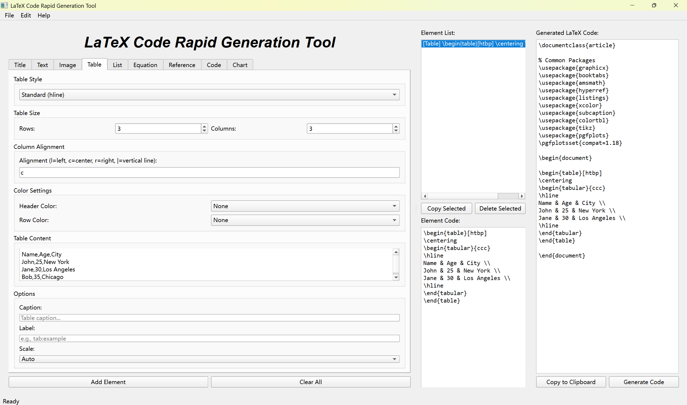
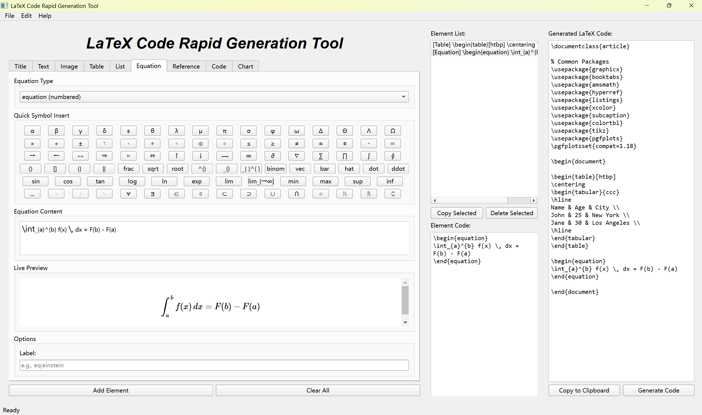
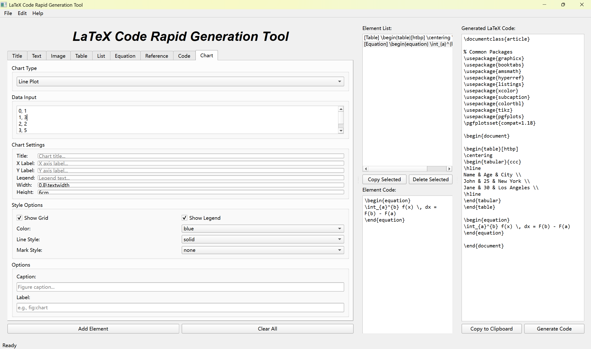

# LaTeX Code Rapid Generation Tool

[](https://apps.microsoft.com/detail/9P5X00J0X9V7)

A powerful desktop application for quickly generating LaTeX code snippets with a user-friendly graphical interface.






## Features

### Element Generation
- **Title** - Generate various title formats (section, subsection, chapter, etc.)
- **Text** - Text with style options (bold, italic, underline, etc.) and alignment
- **Image** - Single or multiple images with subfigure support
- **Table** - 8 different table styles with color customization
- **List** - Itemize, enumerate, and description lists with nesting support
- **Equation** - Mathematical equations with live preview and quick symbol insertion
- **Reference** - Citations and cross-references with BibTeX support
- **Code** - Code blocks with syntax highlighting (verbatim, listings, minted, algorithmic)
- **Chart** - Data visualization with pgfplots (line, bar, scatter, pie, etc.)

### User Interface
- Three-column layout: Input Panel | Element List | Generated Code
- Real-time equation preview using MathJax
- Quick symbol insertion buttons for equations
- Element code preview on selection
- Copy individual elements or full document
- Maximized window on startup

### Menu Bar
- **File** - New Project, Exit
- **Edit** - Copy Code, Clear All
- **Help** - About, License (PySide6), LaTeX Resources

## Usage

1. **Select Element Type** - Choose from the tabs (Title, Text, Image, etc.)
2. **Configure Options** - Set style, size, alignment, and other parameters
3. **Enter Content** - Input your data in the content area
4. **Add Element** - Click "Add Element" to add to the element list
5. **Generate Code** - The full LaTeX code is generated automatically
6. **Copy** - Use "Copy to Clipboard" to copy the generated code

## Chart Types Supported

| Chart Type | Description |
|------------|-------------|
| Line Plot | Line graphs with customizable styles |
| Bar Chart | Vertical bar charts |
| Scatter Plot | Scatter plots with various markers |
| Area Plot | Filled area charts |
| Pie Chart | Pie charts with labels |
| Histogram | Histogram plots |
| Box Plot | Box and whisker plots |
| 3D Surface | 3D surface plots |

## Generated Packages

The tool automatically includes necessary LaTeX packages:

```latex
\usepackage{graphicx}
\usepackage{booktabs}
\usepackage{amsmath}
\usepackage{hyperref}
\usepackage{listings}
\usepackage{xcolor}
\usepackage{subcaption}
\usepackage{colortbl}
\usepackage{tikz}
\usepackage{pgfplots}
```

## Screenshots

The application features a clean, three-column interface:
- **Left**: Input tabs for different element types
- **Middle**: Element list and element code preview
- **Right**: Generated LaTeX code

## Author

**KS.STUDIO**

## Support

If you encounter any issues or have suggestions, please open an issue on GitHub.

## Acknowledgments

- [PySide6](https://www.pyside.org/) - Qt for Python
- [MathJax](https://www.mathjax.org/) - Equation rendering
- [pgfplots](http://pgfplots.net/) - LaTeX plotting
